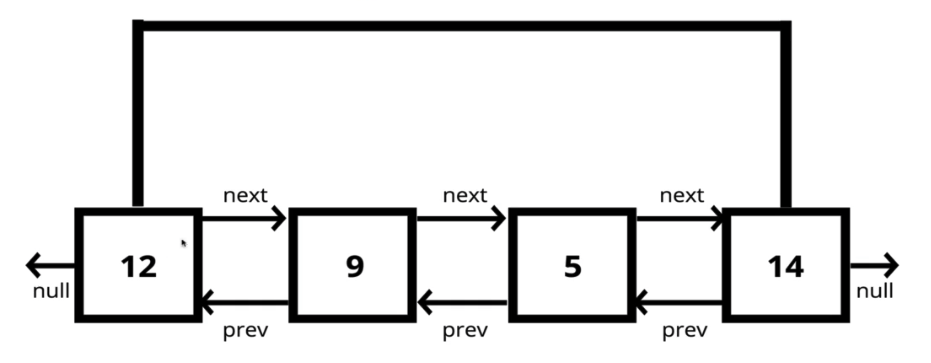

# Doubly Linked List

A data structure that contains a **head**, **tail** and **length** properties

Doubly Linked Lists consist of nodes, and each **node** has a **value**, a **next** pointer to the next node, and a **previous** pointer to the previous node

