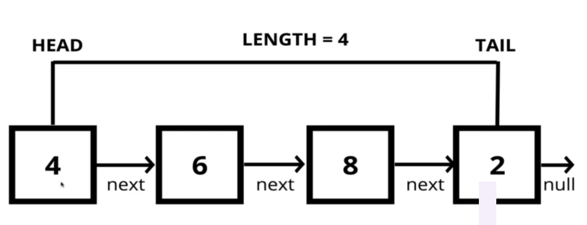

# Singly Linked List

A data structure that contains a **head**, **tail** and **length** properties

Linked Lists consist of nodes, and each **node** has a **value** and a **pointer** to another node or null

## Lists

- Do not have indexes
- Connected via nodes with a next pointer
- Random access is not posible (you have to visit previous nodes)

## Arrays

- Indexed in order
- Insertion and deletion can be expensive (if you add/remove from the beginning)
- Can be accessed quick by index number