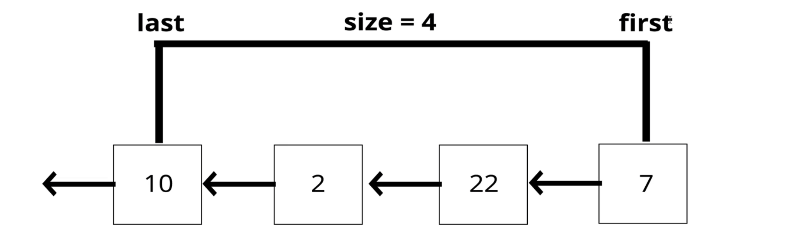

# Stack

They are a **LIFO** data structure.

the last element added to the stack will be the first element removed.

## Uses
* Managing function invocation
* Undo / Redo
* Routing, the history object is treated as a stack